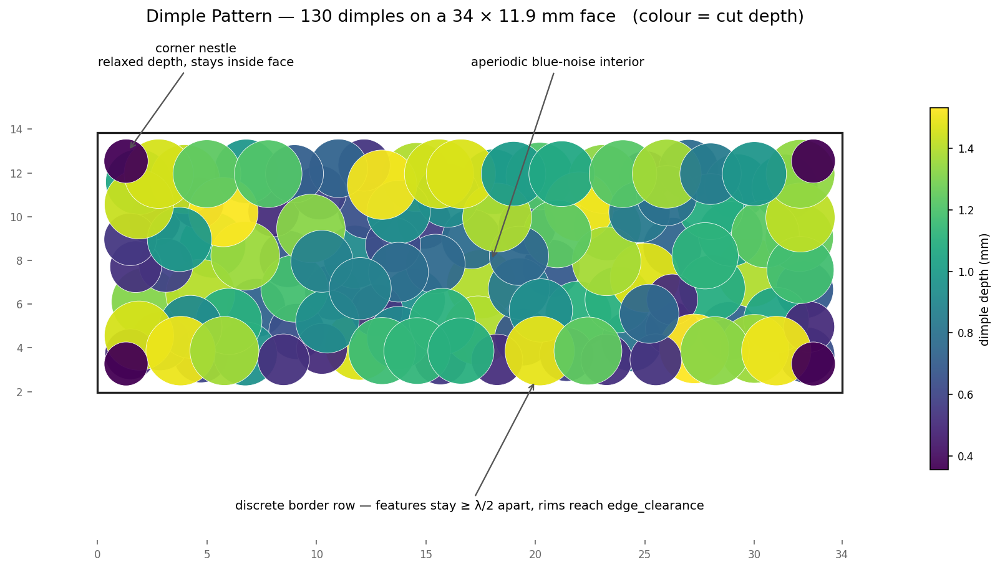
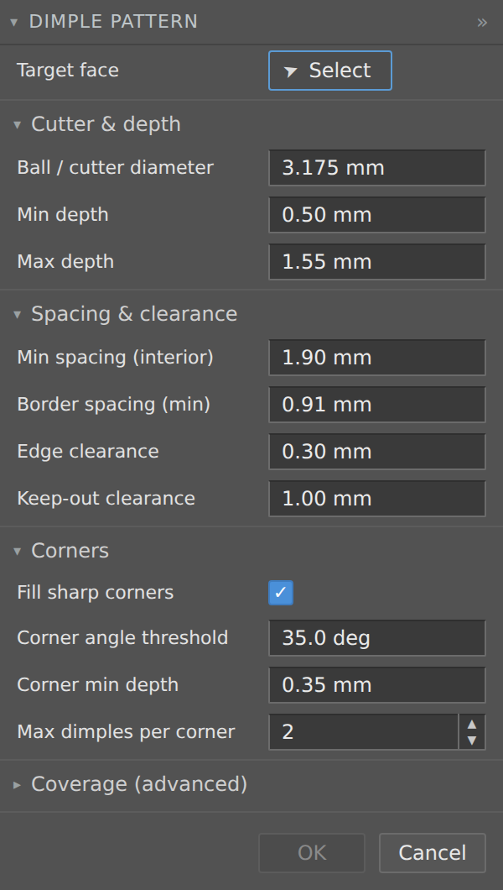

# Dimple Pattern — Fusion 360 Add-In

A Fusion 360 add-in that cuts a **randomized, aperiodic, depth‑randomized spherical‑cap
dimple texture** into a selected planar face. It was built as an acoustic scattering
texture for the non‑active face of an ultrasonic delay line, but it works on any planar
face and is fully parameterized through a native command dialog.

*Plan view of a generated pattern (colour = cut depth). Note the aperiodic blue‑noise
interior, the discrete border row that reaches the edge clearance, and the shallow corner
dimples nestled into each corner while staying inside the face.*

> Select a planar face, open **Dimple Pattern**, adjust the parameters, and click OK.
> The add‑in cuts the dimples as a single Combine feature and never alters your existing
> timeline history.

## Why it works the way it does

The texture exists to diffuse a specular reflection without creating new problems, so three
rules are baked in and should not be "optimized away":

- **The pattern is aperiodic.** A regular grid of scatterers is a diffraction grating
  (`d·sinθ = mλ`) and would beam energy coherently back at the transducer — the exact
  failure this texture prevents. Placement is Poisson‑disk (Bridson) blue noise.
- **Depths are independently randomized** over ≥ λ/2, so the specular glint at each
  dimple's vertex spreads over 0…2π and the glints sum incoherently instead of in phase.
- **Every dimple stays a discrete, wavelength‑scale scatterer.** Features far below λ,
  packed sub‑λ, homogenize into an effective surface (a slightly modified mirror) rather
  than scattering. The generator refuses to shrink/pack below that limit; residual flat
  land is accepted instead, kept small and broken up.

Sharp convex corners can't be filled by round cutters without going sub‑λ, so the add‑in
places one or two **corner dimples** with relaxed depth/spacing, nestled into each corner
but kept **inside** the face (edge clearance is always respected — nothing spills past an
edge). Corner detection is generic: any polygon, any number of corners, any angles;
filleted/curved edges and reflex corners are ignored.

## Requirements

- Autodesk Fusion (the Fusion 360 Python API; Windows or macOS).

## Installation

1. Download this repository (Code → Download ZIP, or `git clone`).
2. Put the whole **`DimplePattern`** folder (containing `DimplePattern.py` and
   `DimplePattern.manifest`) into your Fusion **AddIns** directory:
   - **Windows:** `%APPDATA%\Autodesk\Autodesk Fusion 360\API\AddIns\`
   - **macOS:** `~/Library/Application Support/Autodesk/Autodesk Fusion 360/API/AddIns/`
3. In Fusion, open **Utilities → ADD‑INS → Scripts and Add‑Ins** (Shift+S), go to the
   **Add‑Ins** tab, select **DimplePattern**, click **Run**, and tick **Run on Startup**.

A **Dimple Pattern** button then appears in the **Solid → Create** panel.

## Usage

1. Select one **planar** face (you can also pick it inside the dialog).
2. Click **Dimple Pattern**.
3. Set the parameters and click **OK**. The dialog validates live — OK stays disabled
   until a face is selected and `0 < min depth ≤ max depth < ball radius`.

  

*The command dialog: parameters are grouped like a native Fusion tool, with the advanced
coverage settings collapsed by default.*

## Parameters — quick reference

| Group | Parameter | Default |
|---|---|---|
| Cutter & depth | Ball / cutter diameter | 3.175 mm |
| Cutter & depth | Min depth | 0.50 mm |
| Cutter & depth | Max depth | 1.55 mm |
| Spacing & clearance | Min spacing (interior) | 1.90 mm |
| Spacing & clearance | Border spacing (min) | 0.91 mm |
| Spacing & clearance | Edge clearance | 0.30 mm |
| Spacing & clearance | Keep‑out clearance | 1.00 mm |
| Corners | Fill sharp corners | on |
| Corners | Corner angle threshold | 35° |
| Corners | Corner min depth | 0.35 mm |
| Corners | Max dimples per corner | 2 |
| Coverage (advanced) | Interior fill passes | 3 |
| Coverage (advanced) | Border passes | 8 |
| Coverage (advanced) | Poisson attempts (k) | 30 |
| Coverage (advanced) | Interior / Border raster step | 0.25 / 0.20 mm |
| Coverage (advanced) | Fill spacing fraction | 0.55 |
| Coverage (advanced) | Random seed | 20260717 |

All length fields use real Fusion units, so you can type `3.175 mm` or `1/8 in`.

## Parameters — what each one does

### Cutter & depth

- **Ball / cutter diameter** — the diameter of the cutting sphere (e.g. a 1/8″ ball
  mill = 3.175 mm). Every dimple is a spherical cap cut by this ball, so this sets the
  *maximum* dimple size and the wall curvature. Larger diameter → larger, gentler dimples;
  smaller → tighter, sharper ones. **Max depth must stay below the ball radius**, or the
  cap would sit on a cylindrical wall instead of being a true spherical cap.
- **Min depth** — the shallowest a normal (interior/border) dimple may be cut. This is the
  floor that keeps every feature wavelength‑scale: at the default ball, 0.50 mm gives a
  minimum surface diameter of about 2.31 mm. Raise it for stronger, more uniform scatterers;
  lower it only if you accept smaller (less effective) features.
- **Max depth** — the deepest a dimple may be cut. The generator randomizes each dimple's
  depth between min and max (capped near edges so rims keep their clearance), which is what
  spreads the acoustic phase and prevents coherent glints. A wider min↔max span → more depth
  variation → better incoherence.

### Spacing & clearance

- **Min spacing (interior)** — the Poisson‑disk minimum centre‑to‑centre distance in the
  interior. This controls how densely the blue‑noise field packs. Smaller → more dimples,
  more coverage, but watch that spacing stays above ~λ/2 so features remain discrete.
- **Border spacing (min)** — the minimum centre spacing the border densify pass will use as
  it fills the edge band. It is the *discreteness floor* near edges (default ≈ λ/2 at the
  lowest frequency). Lowering it packs the border tighter and shrinks the residual edge
  land, at the cost of getting closer to homogenization; don't drop it far below λ/2.
- **Edge clearance** — the minimum flat land left between any cut rim and the face boundary
  (for every dimple except corner dimples, which nestle but still respect it). It is a
  machining land so the cutter doesn't run off the edge. Larger → more untouched border;
  smaller → dimples reach closer to the edge.
- **Keep‑out clearance** — extra land added around *interior* keep‑out loops (inner loops of
  the selected face, e.g. a bonded‑transducer footprint). Dimples stay this much further from
  a keep‑out than from the outer edge. Only relevant if the face has interior holes/islands.

### Corners

- **Fill sharp corners** — turns the corner‑nestle pass on or off. With it off, sharp convex
  corners keep a larger residual flat; with it on, each detected corner gets a dimple or two.
- **Corner angle threshold** — how sharp a vertex must be (turning angle, in degrees) to
  count as a "corner" that needs filling. Higher → only very sharp corners are treated;
  lower → gentler corners are treated too. Tessellated fillets and curves never trip it
  because their turning is spread over many vertices.
- **Corner min depth** — corner dimples are allowed to relax their depth down to this value
  (below the global min depth) so a smaller dimple can nestle into a tight corner while still
  staying inside the face. The default (0.35 mm) keeps the smallest corner dimple ≈ 1.99 mm
  in diameter, still ≥ λ. Lower it to nestle corners even tighter (smaller corner features);
  raise it toward the global min depth to keep corner dimples full‑size (larger corner land).
- **Max dimples per corner** — the cap on how many nestle dimples a single corner may get
  (1–2 is plenty for right angles; acute corners may use two).

### Coverage (advanced)

- **Interior fill passes** — extra passes that drop dimples into interior gaps the initial
  blue‑noise field left uncovered. `0` disables it. More passes → tighter interior coverage.
- **Border passes** — how many passes the border densify runs. `0` disables the border
  treatment entirely (leaving a plain edge land). More passes → the edge band is worked more
  thoroughly (with diminishing returns).
- **Poisson attempts (k)** — Bridson candidate attempts per active sample. Higher → slightly
  denser, more uniform blue noise at the cost of a bit more compute; the default of 30 is the
  standard value.
- **Interior / Border raster step** — the grid resolution used to *find* uncovered gaps for
  the fill and border passes. Finer (smaller) → catches smaller gaps but runs slower.
- **Fill spacing fraction** — interior gap‑fill dimples may sit this fraction of the min
  spacing apart, so fill dimples can pack closer than the primary field. Higher → fewer,
  more separated fill dimples; lower → tighter fill.
- **Random seed** — makes the whole pattern deterministic and reproducible. Change it to get
  a different (but statistically identical) arrangement; keep it fixed to reproduce a part.

## How it works (pipeline)

1. **Poisson‑disk** blue‑noise interior sampling.
2. **Interior gap fill** to knock down residual flat land.
3. **Border densify** — full‑size, depth‑randomized dimples that gradient‑ascend to a valid
   centre and reach toward each edge, at a ≥ border‑spacing floor (features stay discrete).
4. **Corner nestle** — relaxed‑parameter dimples inside each detected convex corner.

Each dimple is a sphere of radius `a` centred at `p + n̂·(a − h)`; because `h < a` the
centre sits outside the material, leaving a spherical cap of exactly depth `h`. Surface
diameter is `2·√(2ah − h²)`. The core works in millimetres; conversion to Fusion's internal
centimetres happens only at the API boundary. The cut is applied as a single **base feature +
Combine (cut)**, and a history guardrail ensures the command only appends to your timeline —
it never edits or deletes existing features.

## License

Licensed under the **GNU General Public License v3.0** — see the `LICENSE` file in this
repository, or <https://www.gnu.org/licenses/gpl-3.0.html>.

## Disclaimer

Provided as‑is, without warranty of any kind. The acoustic rationale reflects a specific
delay‑line design; validate against your own part and cutter before relying on it.
